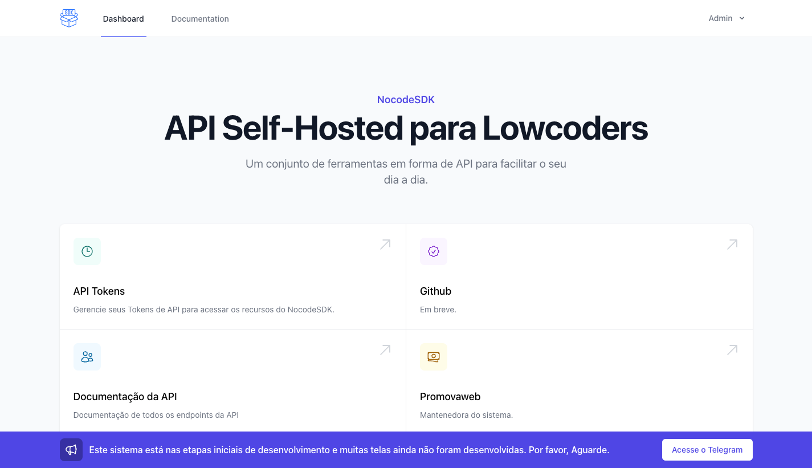

# API Self-Hosted para Lowcoders

Um conjunto de ferramentas em forma de API para facilitar o seu dia a dia.



## Deploy

Salve o arquivo `.env.sample` como `.env` no diretório aonde você irá rodar o
projeto (aonde está o arquivo compose.yaml).

Em seguida gere uma nova API_KEY com o comando:

`echo "base64:$(openssl rand -base64 32)"`

E salve no arquivo `.env`. Não se esqueça de mudar as demais variáveis para os
valores devidos.

```yaml
---
version: "3"

services:
  nocodesdk:
    image: institutoazmina/nocodesdk:latest
    command: "php -d variables_order=EGPCS /var/www/html/artisan --workers=1 octane:start --server=swoole --host=0.0.0.0 --port=80"
    ports:
      80:${PUBLIC_PORT}
    restart: always
    env_file: .env
    environment:
        DB_PASSWORD=${MYSQL_ROOT_PASSWORD}
  redis:
    image: redis:latest
    command: ["redis-server", "--appendonly", "yes"]
  mysql:
    image: mysql
    command: --default-authentication-plugin=mysql_native_password
    restart: always
    env_file: .env
    environment:
      MYSQL_ROOT_PASSWORD: ${MYSQL_ROOT_PASSWORD}
```

## Assista a Live de Apresentação

https://youtu.be/cZIJcbM2MnA
